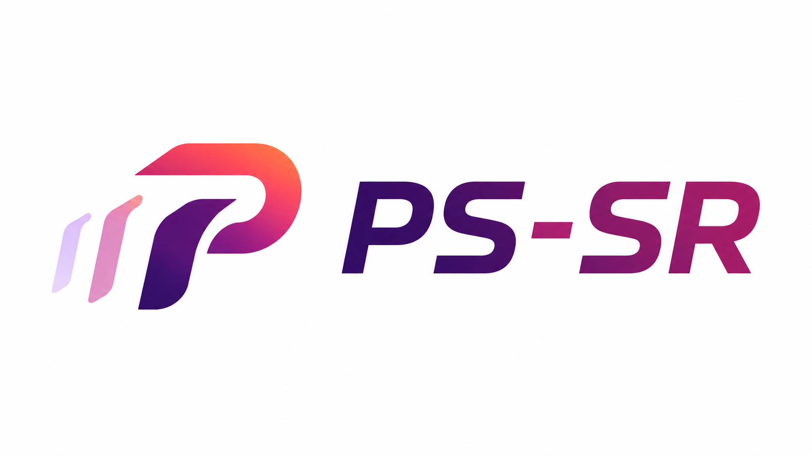

<p align="center">
  
</p>

# PS-SR: Pseudo-Single-Step Video Super-Resolution via Speculative Diffusion

[](https://waq2001.github.io/PS-SR-page/)
[](https://openaccess.thecvf.com/content/CVPR2026/papers/Wu_PS-SR_Pseudo-Single-Step_Video_Super-Resolution_via_Speculative_Diffusion_CVPR_2026_paper.pdf)
[](https://www.youtube.com/watch?v=SlnfddLtQwI)
[](https://mp.weixin.qq.com/s/oZ_5He11hXRKooKLbAyUUw)

> **PS-SR: Pseudo-Single-Step Video Super-Resolution via Speculative Diffusion**  
> **Aiqiu Wu, Zhaofan Qiu, Ting Yao, Tao Mei**  
> In *CVPR*, 2026.

PS-SR is a video super-resolution method that accelerates diffusion-based VSR through speculative diffusion. Instead of relying on either slow multi-step sampling or an aggressively distilled single-step model, PS-SR uses a powerful base model to perform a comprehensive denoising step, then uses a lightweight draft model for subsequent speculative refinement. The draft model reuses guidance from the base trajectory while reducing computation, and a frequency-domain update preserves low-frequency content consistency while injecting high-frequency details from the draft predictions.

This repository provides the official implementation scripts for speculative sampling, frequency-domain update, training, and evaluation.

## Demo

<table>
  <thead>
    <tr>
      <th align="center">Low-Resolution Input</th>
      <th align="center">PS-SR Result</th>
    </tr>
  </thead>
  <tbody>
    <tr>
      <td align="center">
        <video src="https://github.com/user-attachments/assets/3206dcd9-80eb-4d21-ae2d-b1c590311d4c" controls autoplay loop></video>
      </td>
      <td align="center">
        <video src="https://github.com/user-attachments/assets/dbb35453-26a2-49fe-8abe-9c16695bdc49" controls autoplay loop></video>
      </td>
    </tr>
    <tr>
      <td align="center">
        <video src="https://github.com/user-attachments/assets/a978f529-4da4-456f-a5e6-5a83ecc67bc6" controls autoplay loop></video>
      </td>
      <td align="center">
        <video src="https://github.com/user-attachments/assets/f2609d1c-4a16-440e-affa-332f948b9d69" controls autoplay loop></video>
      </td>
    </tr>
    <tr>
      <td align="center">
        <video src="https://github.com/user-attachments/assets/19ea0d12-e6e4-4abe-a659-d391a8a74b73" controls autoplay loop></video>
      </td>
      <td align="center">
        <video src="https://github.com/user-attachments/assets/0f43601b-11d0-4b1c-93e8-3a8ed7f66299" controls autoplay loop></video>
      </td>
    </tr>
  </tbody>
</table>

## Installation

### Requirements

- Linux GPU environment with CUDA
- Python 3.10
- PyTorch 2.7.1
- DiffSynth-Studio 1.1.8

### Environment Setup

```bash
git clone https://github.com/your-repo/PS-SR.git
cd PS-SR

conda create -n pssr python=3.10 -y
conda activate pssr

pip install -r requirements.txt
```

The scripts are designed for GPU inference and training. Adjust the PyTorch/CUDA installation if your cluster requires a specific CUDA build.

## Model Preparation

Create the dependency and checkpoint folders:

```bash
mkdir -p dependent_models/Wan2.1-T2V-1.3B
mkdir -p checkpoints/pretrained_models
```

Download the required auxiliary models and place them as follows:

```text
dependent_models/
|-- DAPE.pth
|-- ram_swin_large_14m.pth
`-- Wan2.1-T2V-1.3B/
    |-- diffusion_pytorch_model.safetensors
    |-- models_t5_umt5-xxl-enc-bf16.pth
    `-- Wan2.1_VAE.pth
```

Model sources:

- DAPE: [Google Drive](https://drive.google.com/file/d/1KIV6VewwO2eDC9g4Gcvgm-a0LDI7Lmwm/view?usp=drive_link)
- RAM: [ram_swin_large_14m.pth](https://huggingface.co/spaces/xinyu1205/recognize-anything/blob/main/ram_swin_large_14m.pth)
- Wan2.1-T2V-1.3B: [Wan-AI/Wan2.1-T2V-1.3B](https://huggingface.co/Wan-AI/Wan2.1-T2V-1.3B)

Download the PS-SR [pretrained checkpoints](https://drive.google.com/drive/folders/1TUO80tp3I4N93Q_rOsn_HopMeXpHSpCO?usp=sharing) and place them as follows:

```text
checkpoints/pretrained_models/
|-- base.safetensors
`-- draft.safetensors
```

## Quick Start

Put low-resolution input videos in `videos_for_test/input/`, then run speculative sampling followed by frequency-domain update:

```bash
python inference_step_1.py \
    --input_dir videos_for_test/input \
    --output_dir videos_for_test/output \
    --lora_base_path ./checkpoints/pretrained_models/base.safetensors \
    --lora_draft_path ./checkpoints/pretrained_models/draft.safetensors \
    --wan_model_dir ./dependent_models/Wan2.1-T2V-1.3B

python inference_step_2.py \
    --consistent_dir videos_for_test/output/base \
    --sharp_dir videos_for_test/output/base+draft_3 \
    --output_dir videos_for_test/output/final
```

Final super-resolved videos are written to:

```text
videos_for_test/output/final/
```

## Inference

### Step 1: Speculative Sampling

`inference_step_1.py` loads the base and draft checkpoints, applies temporal and spatial sliding-window inference, and writes the base prediction together with draft predictions at the configured speculative timesteps. With the default `--timestep_base 699` and `--timestep_draft_list "[599,499,399]"`, the script writes `base/` and three draft branches.

```bash
python inference_step_1.py \
    --input_dir /path/to/input_videos \
    --output_dir /path/to/output_root \
    --lora_base_path ./checkpoints/pretrained_models/base.safetensors \
    --lora_draft_path ./checkpoints/pretrained_models/draft.safetensors \
    --wan_model_dir ./dependent_models/Wan2.1-T2V-1.3B \
    --window_t 33 \
    --overlap_t 16 \
    --window_h 720 \
    --window_w 1280
```

Default outputs under `--output_dir`:

```text
output_root/
|-- base/
|-- base+draft_1/
|-- base+draft_2/
`-- base+draft_3/
```

Useful options include `--prompt`, `--negative_prompt`, `--seed`, `--torch_dtype`, `--cfg_scale`, `--timestep_base`, `--timestep_draft_list`, `--sort_files`, `--skip_existing`, `--temp_dir`, and `--keep_temp`.

### Step 2: Frequency-Domain Update

`inference_step_2.py` exposes the paper's frequency-domain update as a separate fusion script. The default setup keeps the low-frequency structure from `base/` and blends high-frequency details from `base+draft_3/`.

```bash
python inference_step_2.py \
    --consistent_dir /path/to/output_root/base \
    --sharp_dir /path/to/output_root/base+draft_3 \
    --output_dir /path/to/output_root/final
```

Useful fusion options include `--fc`, `--alpha`, `--border`, `--order`, `--window_t`, `--overlap_t`, `--window_h`, `--window_w`, `--sort_files`, and `--skip_existing`. The default fusion strength is `--alpha 0.6`, matching the value used by the released script.

## Evaluation

Use `eval_metrics.py` to evaluate restored videos or image sequences.

Full-reference evaluation:

```bash
python eval_metrics.py \
    --gt /path/to/ground_truth \
    --pred /path/to/predictions \
    --out /path/to/metrics_output \
    --metrics psnr,ssim,lpips \
    --crop 0
```

No-reference evaluation is supported by omitting `--gt` and selecting no-reference metrics available in `pyiqa`, for example:

```bash
python eval_metrics.py \
    --pred /path/to/predictions \
    --metrics clipiqa
```

The script writes a JSON summary named `metrics_<metric_names>.json` to `--out`. If `--out` is omitted, the JSON file is saved in the prediction folder.

## Training

Training uses `accelerate` and the configs in `config/`. The training pipeline follows the paper's base/draft decomposition: train the base model first, then initialize and train the lightweight draft model from the trained base checkpoint. The provided shell scripts are examples for single-node and multi-node runs:

```bash
bash train_base.sh
bash train_draft.sh
```

### Dataset Format

Training data is read by `VideoDataset` in `Wan_SR/trainers/utils.py`.

- `--dataset_base_path` points to the folder containing videos or images.
- `--dataset_metadata_path` accepts CSV or JSON metadata.
- `--data_file_keys` defaults to `image,video,LQ_video`.
- Metadata should include paths relative to `--dataset_base_path`.
- Prompt text is expected in the metadata. If metadata is not provided, the dataset loader can generate metadata from media files with same-name `.txt` prompt files.

Example CSV:

```csv
video,prompt
dataset/0001.mp4,"4K Ultra-clear, Sharp, Fine Details Restored, Temporal Consistency, Natural Colors"
```
> **Note:** `"4K Ultra-clear, Sharp, Fine Details Restored, Temporal Consistency, Natural Colors"` is the default prompt used during training. You may use a different prompt, but the same prompt should also be used during inference to ensure consistency between training and inference.

### Base Model Training

`train_base.py` trains the base LoRA and regularization branch. The base model is responsible for the comprehensive denoising step that anchors content and temporal consistency. A minimal command is:

```bash
accelerate launch \
    --config_file ./config/accelerate_config_single.yaml \
    train_base.py \
    --dataset_base_path ./datasets/YouHQ \
    --dataset_metadata_path ./metadata_YouHQ.csv \
    --wan_model_dir ./dependent_models/Wan2.1-T2V-1.3B \
    --output_path ./experiments/train_base \
    --lora_model_base dit \
    --lora_model_reg dit_update \
    --lora_target_modules q,k,v,o,ffn.0,ffn.2 \
    --lora_rank 32 \
    --save_steps 200 \
    --save_latest True
```

Expected outputs include:

```text
experiments/train_base/
|-- latest_base.safetensors
`-- latest_reg.safetensors
```

### Draft Model Training

`train_draft.py` trains the lightweight draft model from a trained base checkpoint. The draft model prunes the DiT backbone according to `--k_select` and adds feature-fusion layers for speculative refinement after the base step:

```bash
accelerate launch \
    --config_file ./config/accelerate_config_single.yaml \
    train_draft.py \
    --dataset_base_path ./datasets/YouHQ \
    --dataset_metadata_path ./metadata_YouHQ.csv \
    --wan_model_dir ./dependent_models/Wan2.1-T2V-1.3B \
    --output_path ./experiments/train_draft \
    --lora_model_base dit \
    --lora_target_modules q,k,v,o,ffn.0,ffn.2 \
    --lora_rank 32 \
    --save_steps 200 \
    --save_latest True \
    --load_model_base_from ./experiments/train_base/latest_base.safetensors
```

Expected output:

```text
experiments/train_draft/
`-- latest_draft.safetensors
```

For distributed training, use `config/accelerate_config_multi.yaml` and set the standard multi-node variables required by the example scripts, such as `RANK`, `MASTER_ADDR`, and `MASTER_PORT`.

## Repository Structure

```text
PS-SR/
|-- checkpoints/          # PS-SR pretrained or trained checkpoints
|-- config/               # Accelerate configuration files
|-- dependent_models/     # DAPE, RAM, and Wan2.1 dependency weights
|-- models/               # Local model assets and tokenizer files
|-- videos_for_test/      # Example input/output video folders
|-- Wan_SR/               # Core PS-SR implementation
|-- inference_step_1.py   # Base and draft video SR inference
|-- inference_step_2.py   # Frequency-domain output fusion
|-- eval_metrics.py       # Video/image quality evaluation
|-- train_base.py         # Base model training
|-- train_draft.py        # Draft model training
`-- requirements.txt
```

## Citation

If you find this work useful for your research, please cite:

```bibtex
@inproceedings{wu2026pssr,
  title={PS-SR: Pseudo-Single-Step Video Super-Resolution via Speculative Diffusion},
  author={Wu, Aiqiu and Qiu, Zhaofan and Yao, Ting and Mei, Tao},
  booktitle={Proceedings of the IEEE/CVF Conference on Computer Vision and Pattern Recognition},
  year={2026}
}
```

## Acknowledgements

This codebase is built upon or inspired by excellent open-source projects in video restoration and diffusion modeling, including:

- [OSEDiff](https://github.com/cswry/OSEDiff)
- [DOVE](https://github.com/zhengchen1999/DOVE)
- [DiffSynth-Studio](https://github.com/modelscope/DiffSynth-Studio)
- [Wan2.1](https://huggingface.co/Wan-AI/Wan2.1-T2V-1.3B)

## License

This project is released under the Apache-2.0 License. See [LICENSE](LICENSE) for details.
